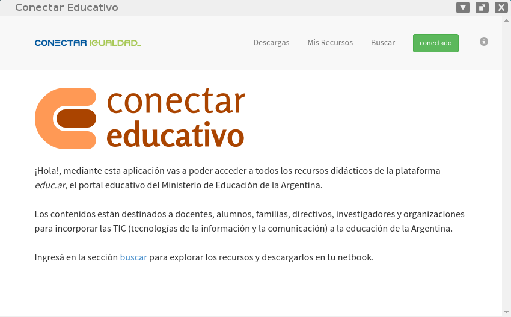

Conectar Educativo
==================

Aplicación de escritorio pensada para realizar búsquedas y consumir offline
los recursos del portal educ.ar, basada en el stack de
tecnologías: node-webkit, nedb, express, rest y angular.js




```
  git clone https://github.com/ajchambeaud/conectar-educativo
  cd conectar-educativo
  npm install
  cd ..
```

También es importante tener instalado el comando `ffmpegthumbnailer`, y
`node-webkit`

<a href="https://github.com/rogerwang/node-webkit#downloads" target="_blank">Descarga</a> el binario de node-webkit para tu plataforma y usalo para ejecutar la aplicación.

```
  nw conectar-educativo
```

# Mas información

Recomendamos estos links para conocer mas sobre las tecnologías que
estamos utilizando:

- https://github.com/rogerwang/node-webkit
- https://github.com/rogerwang/node-webkit/wiki/How-to-package-and-distribute-your-apps
- https://github.com/buberdds/node-webkit-nedb-rest-angular
